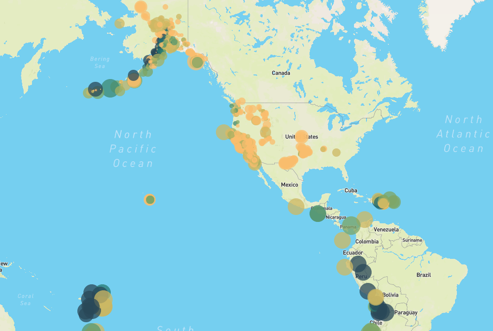
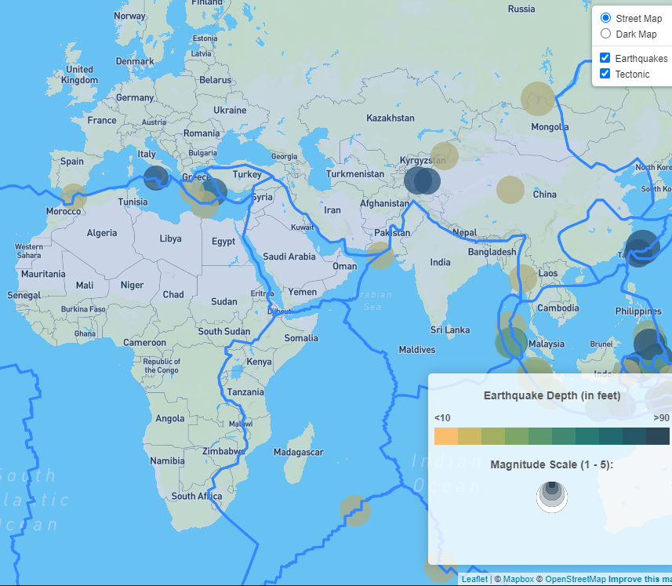

# Leaflet Map of Earthquake Data

## Objective

To map earthquake data downloaded from the United States Geological Society (USGS) using Leaflet, and to add a layer helping viewers understand the relationship between earthquakes and the location of tectonic fault lines. Map features include a legend and pop-ups with additional information about particular earthquake events.

---
## See the basic visualization here:
https://millerbrook.github.io/Leaflet-Map-of-Earthquake-Data/
---
## Steps

### Step 1
Query USGS for recent earthquake data using D3's JSON feature:

```
// Store our API endpoint inside queryUrl
var queryUrl = "https://earthquake.usgs.gov/earthquakes/feed/v1.0/summary/all_week.geojson";

// Perform a GET request to the query URL
d3.json(queryUrl).then(function(data) {
  
  // Once we get a response, send the data.features object to the createFeatures function
  //console.log(data.features)
  createFeatures(data.features);
});
```


### Step 2
Plot the data using Leaflet and Mapbox  
  


### Step 3  

Add a tectonic plate layer and a legend  

  

[Source data on tectonic plates](<https://github.com/fraxen/tectonicplates>)

---

## Contact Information

Brook Miller

[Email](millerbrook@gmail.com)

[LinkedIn](www.linkedin.com/in/brook-miller-data)
